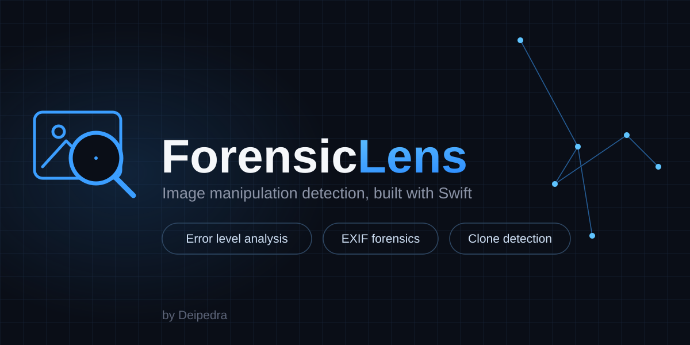
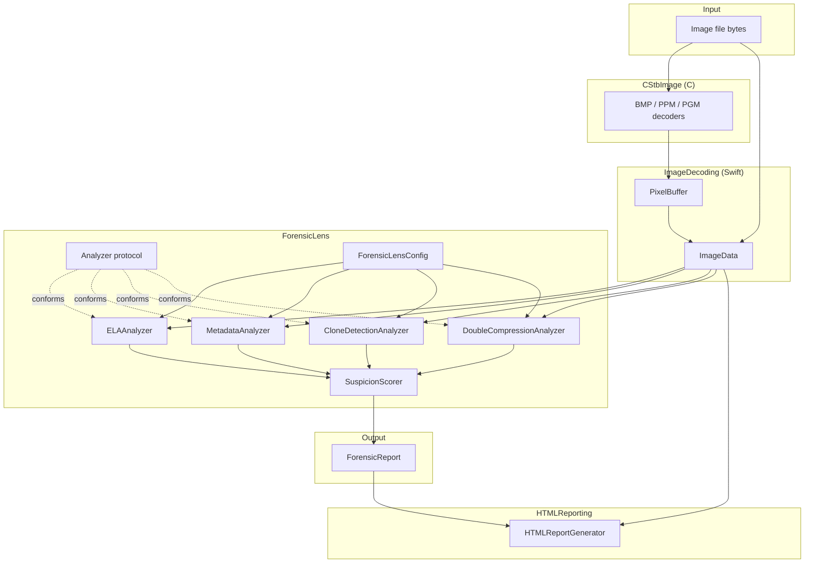

<p align="center">
  <a href="https://github.com/Deipedra34/ForensicLens/actions/workflows/tests.yml"></a>
  <a href="https://codecov.io/gh/Deipedra34/ForensicLens"></a>
  <a href="https://swiftpackageindex.com/Deipedra34/ForensicLens"></a>
  <a href="https://swiftpackageindex.com/Deipedra34/ForensicLens"></a>
</p>

<p align="center">
  
</p>

# ForensicLens

A Swift library and CLI for spotting signs of digital manipulation in still images. It runs four independent forensic techniques (Error Level Analysis, EXIF/metadata inconsistency checks, copy-move/clone detection, and double JPEG compression detection) and rolls the results into a single 0-100 suspicion score plus an itemized, human-readable report.

Pure Swift and C, no Apple-only frameworks. Builds and tests on macOS and Linux.

## Why four techniques instead of one

None of these methods are conclusive on their own, and each one is blind to a different kind of edit.

- **ELA** catches localized edits in a JPEG's compression history: a pasted patch that hasn't been through the same recompression as everything around it. It has nothing to say about a clean copy-move that happened within a single compression pass, though.
- **Metadata analysis** catches evidence left behind by an editing tool or an impossible timestamp, but a careful edit that strips or fakes EXIF just sails right through it.
- **Clone detection** catches duplicated regions no matter what the compression history looks like, but it's blind to edits that don't involve copying part of the same image.
- **Double compression detection** catches whether the file was JPEG-compressed *twice* -- the fingerprint left by opening an already-compressed photo, editing it, and saving it again -- even when the edit itself was a clean, precisely-aligned copy-move that leaves ELA and clone detection with nothing unusual to see. It has nothing to say about a first-generation, once-compressed original, edited or not.

Run all four and combine the results, and you catch a wider range of edits than any single technique would on its own. That's the whole point of `SuspicionScorer`.

## Architecture



The rule that keeps this modular: **`CStbImage` is the only place C code lives, and `ImageDecoding` is the only module allowed to import it.** Everything above `ImageDecoding` (every analyzer, the scorer, the CLI) works exclusively with the plain-Swift `PixelBuffer` / `ImageData` types and never sees a C pointer. Swapping in a real JPEG decoder later, or adding PNG support, means touching `ImageDecoding` and nothing else.

Analyzers themselves are pluggable through the `Analyzer` protocol. `ForensicLensEngine` doesn't know about `ELAAnalyzer` or `CloneDetectionAnalyzer` by name; it just runs whatever's in its analyzer list and enabled in config. Adding a fourth analyzer later is just a matter of conforming to the protocol and registering it.

Above a configurable size threshold, `ForensicLensEngine` routes an image through `Sources/ForensicLens/Tiling` before it ever reaches an analyzer: the tiling layer splits the decoded `PixelBuffer` into overlapping tiles, drives each analyzer's existing, unmodified `analyze` method per tile, and stitches the per-tile findings back into one report -- see "Tiled processing for large images" below. Every analyzer keeps operating on a single `ImageData`/`PixelBuffer`, exactly as the diagram above shows; tiling is an implementation detail of what gets handed to `ImageData`, not a change to the `Analyzer` contract itself.

## Features

| Analyzer | What it looks for | Needs decoded pixels? | Needs EXIF? |
|---|---|:---:|:---:|
| Error Level Analysis | Regions with a compression-error signature inconsistent with the rest of the image | Yes | No |
| EXIF / Metadata | Editing-software signatures, impossible or drifted timestamps, missing camera fields, cross-field inconsistencies (GPS vs. capture timestamp, GPS vs. camera identity, GPS altitude sign, editing software vs. unedited-camera claim) | No | Yes (JPEG only) |
| Copy-Move (Clone) Detection | Duplicated blocks pasted elsewhere in the same image | Yes | No |
| Double JPEG Compression Detection | A periodic pattern in a DCT coefficient's histogram, left behind when a JPEG is decompressed, edited, and re-compressed a second time | Yes (JPEG only) | No |

| Capability | Status |
|---|---|
| Library + CLI in one package | Yes |
| Plain-text, JSON, and CSV report output | Yes |
| Self-contained HTML visual report with region overlays | Yes |
| Per-analyzer enable/disable via config | Yes |
| Tiled processing of large images (bounded memory, cross-tile clone detection) | Yes |
| Concurrent batch scanning of a directory of images | Yes |
| Cross-platform (macOS / Linux) | Yes |
| Third-party dependencies | None |

### HTML visual report

Text and JSON reports say *what* was flagged; the HTML report shows *where*. `--html-report` writes a single `.html` file that opens in any browser, with nothing else to ship alongside it:

- **Suspicion score** and verdict at the top, color-coded by severity.
- **The analyzed image**, embedded directly in the page as a base64 `data:` URI (BMP and JPEG are embedded byte-for-byte; PPM/PGM, which browsers can't display, are converted to BMP from the already-decoded pixels).
- **Semi-transparent overlay boxes** on the image for every region an analyzer flagged, one color per analyzer: orange for Error Level Analysis, blue for copy-move (clone) detection -- both the source block and its copy -- and purple for double JPEG compression, whose evidence is image-wide, so its box covers the whole area the DCT histogram was sampled from.
- **A checkbox per analyzer** above the image to show or hide that layer (a few lines of inline JavaScript, no libraries), plus a legend mapping each color to its analyzer.
- **The full findings breakdown** below the image: analyzer name, score, summary, and every indicator with its region coordinates -- the same information as the text/JSON report.

An image with nothing flagged still gets a valid report that says "No anomalies detected." Overlay coordinates are in the original image's pixel space (the same `regions` now included on each `Indicator` in JSON output), so boxes stay aligned at any zoom level.

<!-- Screenshot placeholder: add docs/images/html-report.png showing a report with ELA and clone overlays, then reference it here. -->

## Installation

Requires Swift 5.9+.

**As a library**, add it to your `Package.swift`:

```swift
dependencies: [
    .package(url: "https://github.com/Deipedra34/ForensicLens.git", from: "1.0.0")
]
```

and depend on the `ForensicLens` product from your target. If you're working from a local checkout instead, `.package(path: "../forensiclens")` works the same way.

**As a CLI**, build it from source:

```sh
git clone https://github.com/Deipedra34/ForensicLens.git
cd ForensicLens
swift build -c release
.build/release/forensiclens-cli report path/to/image.bmp
```

## CLI usage

```
forensiclens-cli <command> <image-path> [--json] [--config <path>] [--html-report <path>]
forensiclens-cli batch <directory> [options]

COMMANDS:
  report              Run every enabled analyzer and print a combined report.
  ela                 Run only Error Level Analysis.
  metadata            Run only EXIF/metadata analysis.
  clone               Run only copy-move (clone) detection.
  doublecompression   Run only double JPEG compression detection.
  batch               Scan a directory of images and print one summary report.
  help                Show usage.

OPTIONS (report / ela / metadata / clone / doublecompression):
  --json           Print the report as JSON instead of plain text.
  --html-report <path>
                   Also write a self-contained HTML report to <path>:
                    the image with each analyzer's flagged regions
                    overlaid, per-analyzer layer toggles, and the
                    full findings breakdown.
  --config <path>  Path to a forensiclens.yaml config file.
                    Defaults to ./forensiclens.yaml; a missing file
                    falls back to built-in defaults.
  --tile-size <n>  Force this tile size and enable tiling, even below
                    forensiclens.yaml's tilingThreshold. Useful for
                    comparing tiled vs. non-tiled output on the same
                    image. Cannot combine with --no-tiling.
  --no-tiling      Force single-block processing, even above
                    tilingThreshold. Cannot combine with --tile-size.

OPTIONS (batch):
  --no-recursive        Only scan the top-level directory, skip subdirectories.
  --extensions <list>   Comma-separated file extensions to treat as images.
                         Defaults to "jpg,jpeg,png".
  --max-concurrency <n> Maximum number of images analyzed at once. Defaults
                         to the number of available CPU cores.
  --format <fmt>        Report format: text (default), json, or csv.
  --output <path>       Write the report to a file instead of stdout.
  --html-report-dir <path>
                        Write one HTML report per image scoring above
                         the threshold into <path>, plus an index.html
                         linking them all, highest score first.
  --html-report-threshold <score>
                        Minimum score (exclusive) for an HTML report.
                         Defaults to 0: any non-zero score.
  --config <path>       Same as above.
  --tile-size <n>       Same as above, applied to every file in the batch.
  --no-tiling           Same as above, applied to every file in the batch.
```

Examples:

```sh
# Full combined report, plain text
forensiclens-cli report photo.bmp

# Just clone detection, as JSON
forensiclens-cli clone photo.ppm --json

# Custom thresholds
forensiclens-cli report photo.bmp --config strict.yaml

# Recursively scan a folder of images, sorted by suspicion score
forensiclens-cli batch photos/

# Only the top-level directory, and only BMP/PPM files
forensiclens-cli batch photos/ --no-recursive --extensions bmp,ppm

# Export the batch report as JSON instead of printing a table
forensiclens-cli batch photos/ --format json --output report.json

# Visual HTML report with flagged regions overlaid on the image
forensiclens-cli report photo.bmp --html-report photo-report.html

# One HTML report per image scoring above 45, plus reports/index.html
forensiclens-cli batch photos/ --html-report-dir reports/ --html-report-threshold 45

# Compare tiled vs. non-tiled output on the same large image
forensiclens-cli report large-photo.bmp --tile-size 512
forensiclens-cli report large-photo.bmp --no-tiling
```

`batch` reuses the exact same `ForensicLensEngine` pipeline the single-image commands do -- every image is decoded and run through every enabled analyzer, then combined into a `ForensicReport` -- just fanned out concurrently across a whole directory instead of one file at a time. A file that fails to decode (or throws during analysis) is logged to stderr with its path and the reason, then skipped; it never aborts the rest of the batch. Progress ("42/500 processed") and per-file skip warnings go to stderr, so they never contaminate the report on stdout or in `--output`.

With `--html-report-dir`, each image whose overall score is above `--html-report-threshold` (default 0, so any non-zero score) gets its own HTML report in that directory, written as soon as the image finishes so the batch never holds every image in memory at once. Report names are derived from each image's path relative to the scanned directory (`nested/photo.jpg` becomes `nested_photo.jpg.html`). Once the batch completes, an `index.html` in the same directory lists every generated report sorted by suspicion score, highest first, linking to each.

Sample plain-text output:

```
ForensicLens Report
====================
Overall suspicion score: 78/100 (likely manipulated)

[ela] score 62/100 -- 2 region(s) show error levels inconsistent with a single uniform compression history.
  - 4.3% of the image falls inside 2 region(s) with recompression error at or above 28.0 (expected background level for an untouched image is well below this).
  - Region (128,96)-(144,112) shows a mean error level of 61.2, notably higher than the image average of 9.8.
[metadata] score 35/100 -- 1 metadata anomaly found.
  - Software tag reports "Adobe Photoshop 25.0", which matches known editing tool signature "photoshop".
[clone] score 0/100 -- No duplicated regions detected.
[doublecompression] score 42/100 -- Periodic DCT coefficient pattern detected at coefficient (1,1); this image's pixel data is consistent with having been JPEG-compressed twice.
  - Histogram of DCT coefficient (1,1), sampled on an 8x8 block grid offset by (0,0) px, shows a periodic double-peak pattern with periodicity strength 0.31 (threshold 0.24) -- periodic DCT coefficient pattern detected; image was likely re-compressed after editing.
```

### Library usage

```swift
import ForensicLens
import ImageDecoding

let bytes = try Data(contentsOf: fileURL)
let image = try ImageData.load([UInt8](bytes))

let config = try ConfigLoader.load(contentsOfFile: "forensiclens.yaml")
let engine = ForensicLensEngine(config: config)

let report = engine.run(on: image)
print(report.textReport)     // or: JSONEncoder().encode(report)
```

## Configuration reference (`forensiclens.yaml`)

Every key is optional; anything you omit just falls back to the built-in default. See `Sources/ForensicLens/Config/ForensicLensConfig.swift` for the typed `Codable` definitions these map onto.

```yaml
ela:
  enabled: true
  elaQualityLevels: [70, 80, 90] # recompressed & combined at every level listed; consistency across levels drives the score
  errorThreshold: 28          # per-region mean error (0-255) considered "hot"
  flaggedRegionFraction: 0.015 # image area fraction that must be "hot" to flag

metadata:
  enabled: true
  flagMissingExif: false
  suspiciousSoftwareKeywords: [photoshop, gimp, lightroom, "affinity photo", pixelmator, snapseed, "paint.net", picsart]
  maxTimestampDriftSeconds: 2592000  # 30 days
  maxGPSTimestampDriftSeconds: 300   # 5 minutes; GPS timestamp vs. DateTimeOriginal
  maxDigitizedDriftSeconds: 300      # 5 minutes; DateTimeDigitized vs. DateTimeOriginal

cloneDetection:
  enabled: true
  blockSize: 16
  blockStride: 8
  minimumBlockVariance: 20
  similarityThreshold: 6
  minimumBlockDistance: 24

doubleCompression:
  enabled: true
  acCoefficientRow: 1     # row (0-7) of the 8x8 DCT coefficient to histogram
  acCoefficientColumn: 1  # column (0-7) of that coefficient
  periodicityThreshold: 0.24 # fraction of histogram spectral energy in one peak that counts as periodic

tiling:
  enabled: true            # master switch; false always processes as a single block
  tilingThreshold: 4096    # max(width, height) in px above which an image is tiled
  tileSize: 1024           # side length, in px, of each tile's core region
  tileOverlap: 64          # px of extra context on each side; must be a multiple of 8
```

## Per-analyzer implementation notes

Deeper trade-off discussion lives in [`docs/algorithms.md`](docs/algorithms.md) and as doc comments on the analyzer types themselves. Short version:

- **Tiled processing for large images.** Every analyzer below is written and tested against a whole image, and stays that way -- tiling lives entirely in `Sources/ForensicLens/Tiling`, outside the analyzers themselves. Once an image's larger dimension exceeds `tilingThreshold`, `ForensicLensEngine` splits it into overlapping tiles (`tileSize` core, `tileOverlap` of extra context on each side) instead of decoding and holding the whole thing as one block, which is what actually bounds peak memory on a very large input. ELA and double-compression detection run unmodified against each tile and get merged back into one image-wide finding (`SpatialTileMerger`), taking the strongest tile's score plus a small corroboration bonus from other hot tiles rather than summing every tile -- summing would double-count a real anomaly caught independently by two overlapping tiles. `tileOverlap` defaults to 64px and must stay a multiple of 8: both analyzers work in JPEG's native 8x8 DCT block grid, and a non-8-aligned overlap would shift that grid out of phase at a tile boundary, showing up as a spurious seam of recompression error. **Clone detection gets different treatment, and it's a correctness guarantee, not just a performance detail:** its candidate-block fingerprint index is built and searched globally across every tile rather than reset per tile, so a copy-move whose source and pasted copy land in two distant tiles is still found -- see `TiledCloneDetection`'s doc comment. Metadata analysis isn't tiled at all; it just reads EXIF once from the whole file, same as always. Tiling is fully transparent to the CLI: `report`, `ela`, `clone`, etc., and `batch`, all go through the same `ForensicLensEngine.run`, with no separate tiled code path to opt into. Use `--tile-size <n>` / `--no-tiling` to force one path or the other for comparison.
- **ELA** doesn't rely on a real JPEG codec. It simulates a JPEG-style lossy recompression pass (block DCT, quantize at a configured quality, dequantize, inverse DCT) directly against the decoded pixel buffer, which is the exact lossy step ELA actually depends on. That's what lets it run against any format this package can decode, not just JPEG. Rather than trusting a single arbitrarily-chosen quality, it recompresses at every quality listed in `elaQualityLevels` (default `[70, 80, 90]`) and combines the resulting error maps: each pixel's combined error is scaled by the *fraction* of quality levels that independently flagged it as an outlier, so a region that's only hot at one quality level gets suppressed toward the noise floor, while a region that's hot at every configured level keeps its full weight. That cross-level consistency, not the single noisiest level, is what drives the suspicion score -- see `ELAAnalyzer.combine`'s doc comment for the full reasoning. Scanning at N quality levels costs roughly N times the work of the old single-quality pass.
- **Metadata analysis** reads EXIF straight out of the raw file bytes, from the `APP1` marker segment, so it works even on JPEGs whose pixel data this package can't decode. Beyond flagging individual fields (missing, malformed, editing-software signatures), it also runs cross-field checks that compare related values against each other, since two contradicting fields are a stronger tampering signal than either looks alone: GPS timestamp vs. `DateTimeOriginal` (default 5-minute tolerance -- see `MetadataAnomaly.gpsTimestampDrift`'s doc comment for why this assumes both clocks read the same wall-clock time, and its limits on cameras set to local time), `DateTimeDigitized` vs. `DateTimeOriginal` drift (default 5 minutes), GPS location present without camera Make/Model or vice versa (asymmetric weighting -- GPS without an identified device is the more surprising direction), `GPSAltitude` decoding negative without `GPSAltitudeRef` indicating "below sea level", and a `Software` tag naming an editor while Make/Model/Lens and an unchanged `ModifyDate` still claim an untouched camera original.
- **Clone detection** filters out flat, low-variance blocks before comparing anything. Skip that step and a clear sky or a plain wall would "match" itself thousands of times over and swamp any real finding. On a tiled (large) image, its candidate index still spans the whole image rather than resetting per tile, so a copy-move whose source and pasted copy fall in two different tiles is still caught -- see "Tiled processing for large images" above.
- **Double compression detection** looks for the classic double-JPEG-compression signature: it splits the decoded image into an 8x8 grid of luma blocks (JPEG's own block size), runs a forward DCT on each one, and builds a histogram of one chosen low-frequency AC coefficient (`(1,1)` by default) across every block. A JPEG compressed once quantizes that coefficient to multiples of a single step, which just thins the histogram out evenly. Compressing a *second* time at a different quality requantizes values that are already multiples of the first step to multiples of a second, generally different one -- and because the two steps don't line up, some of the final histogram's non-empty bins end up noticeably fatter or thinner than their neighbors, in a pattern that repeats with a period tied to the ratio between the two steps. This analyzer removes the histogram's broad, natural envelope (a small local moving average) and runs a discrete Fourier transform over what's left, purely to see whether one frequency's energy dominates -- a strong single peak means a periodic comb is present; a flat spectrum means the histogram never had one. Since a crop between the two compressions shifts JPEG's 8x8 block grid relative to the file's own pixel `(0, 0)`, it repeats this scan at several candidate pixel offsets and keeps whichever one shows the strongest periodicity. Being a JPEG-quantization-specific signal, it reports "not applicable" on any non-JPEG input rather than a false negative. See `DoubleCompressionAnalyzer` and `DCTPeriodicityAnalysis`'s doc comments for the full reasoning.

## Image format support

Decoding lives entirely in `CStbImage` (C) behind the `ImageDecoding` module, and currently covers uncompressed BMP and binary PPM/PGM. That's enough to build every test fixture in-process without shipping binary test assets or depending on a real JPEG decoder. JPEG *files* are recognized by magic number (so metadata analysis works on them), but JPEG *pixel* decoding is a documented stub (`cstbi_decode_jpeg_baseline`). ELA, clone detection, and double compression detection require decoded pixels, so they'll throw `AnalyzerError.unsupportedInput` on a JPEG until a real decoder gets dropped in behind that one seam.

## Benchmarking

```sh
scripts/benchmark/run.sh
```

This builds and runs `forensiclens-benchmark` in release mode against synthetic noise images at a few sizes.

The table below is generated by [`.github/workflows/benchmark.yml`](.github/workflows/benchmark.yml) from that script's `--json` output (via `scripts/benchmark/update-readme.sh`) and reflects the most recent run on GitHub's `ubuntu-latest` runners, so it stays current without anyone copying numbers in by hand. **Don't hand-edit the table between the markers below** -- change the benchmark script or the workflow instead and let CI regenerate it; a manual edit will just get overwritten on the next run.

<!-- BENCHMARK-TABLE-START -->

| Analyzer | Image size | Time (ms) |
| --- | --- | --- |
| ELA | 64x64 | 2.20 |
| Clone Detection | 64x64 | 0.12 |
| Double Compression | 64x64 | 1.28 |
| Metadata | 64x64 | 0.00 |
| ELA | 128x128 | 7.29 |
| Clone Detection | 128x128 | 0.96 |
| Double Compression | 128x128 | 6.44 |
| Metadata | 128x128 | 0.00 |
| ELA | 256x256 | 29.47 |
| Clone Detection | 256x256 | 12.32 |
| Double Compression | 256x256 | 23.46 |
| Metadata | 256x256 | 0.00 |

<!-- BENCHMARK-TABLE-END -->

ELA scales roughly linearly with pixel count, since it's a fixed amount of work per 8x8 block -- multiplied by the number of quality levels in `elaQualityLevels` (3 by default), since it recompresses once per configured level. Dropping to fewer quality levels is the lever to pull if ELA itself is the bottleneck; the table above reflects the default three-level scan, so it runs roughly 3x what a single-quality scan would take. Clone detection scales worse: it compares every candidate block against every other candidate block, which is quadratic in block count. So a larger `blockSize` or `blockStride` in `forensiclens.yaml` is the lever to pull if it's too slow on large images. Metadata analysis only reads a file's header, so its cost stays flat regardless of image size.

These sizes all sit well under the default `tilingThreshold` (4096px), so the table above reflects the untiled, single-block path every image this small already used before tiling existed. A genuinely "large" case -- large enough to trigger tiling automatically -- isn't in the automated table above: clone detection's quadratic block-comparison cost (see above) makes a multi-thousand-pixel image impractically slow for a CI benchmark run regardless of tiling, since tiling pools candidates globally rather than shrinking that comparison (a correctness requirement -- see "Tiled processing for large images"). Tiling exists to bound peak *memory* on a large image, not to reduce total analysis work, so it wouldn't materially change these numbers anyway for the analyzers it does apply to. To see tiling's effect on a specific large image of your own, compare `--tile-size <n>` against `--no-tiling` directly:

```sh
forensiclens-cli report large-photo.bmp --tile-size 512 --json
forensiclens-cli report large-photo.bmp --no-tiling --json
```

## Testing

```sh
swift test
```

The whole suite runs offline, without special privileges or real photos, against synthetic images built in-memory by `Tests/ForensicLensTests/Fixtures.swift`. Each analyzer has its own test file (`ELAAnalyzerTests.swift`, `MetadataAnalyzerTests.swift`, `CloneDetectionAnalyzerTests.swift`, `DoubleCompressionAnalyzerTests.swift`), plus `ScoringTests.swift` and `ConfigTests.swift`, and between them they cover edge cases like corrupt image bytes, images with no EXIF, and uniform images with nothing to clone. `DoubleCompressionAnalyzerTests.swift` builds its own synthetic, natural-photo-like texture and feeds it through the same block-DCT recompression simulator `ELAAnalyzer` uses -- once for the single-compression case, twice at different qualities for the double-compression case -- to verify the periodicity check fires only on the latter. `BatchCommandTests.swift` covers the `batch` CLI command; it's the one file in the suite that touches the filesystem, writing its fixture images to a temporary directory (still no network access, and nothing committed to the repo) to exercise real directory scanning and fault isolation on a corrupt file. `TilingTests.swift` covers the tiling layer directly: tile geometry (including partial edge tiles on an image that doesn't divide evenly), automatic activation above `tilingThreshold`, that `--no-tiling` and forced tiling produce materially equivalent scores on the same image, and -- the one correctness requirement in this feature, not just a performance one -- that a synthetic clone spanning two distant tiles is still detected. `TilingCLITests.swift` covers `--tile-size` / `--no-tiling` flag parsing, including the two flags' mutual exclusivity.

To generate the same coverage report as CI locally (Linux/macOS with the Swift toolchain's `llvm-cov`/`llvm-profdata`):

```sh
swift test --enable-code-coverage
llvm-profdata merge -sparse .build/debug/codecov/*.profraw -o .build/debug/codecov/default.profdata
llvm-cov export -format="lcov" \
  .build/debug/forensiclensPackageTests.xctest \
  -instr-profile .build/debug/codecov/default.profdata \
  > coverage.lcov
```

## License

MIT, see [LICENSE](LICENSE).

---

<p align="center"><em>-by Deipedra</em></p>
