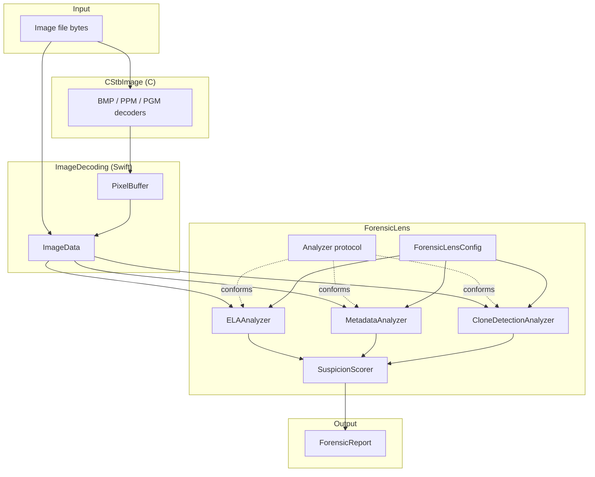

# ForensicLens

A Swift library and CLI for spotting signs of digital manipulation in still images. It runs three independent forensic techniques (Error Level Analysis, EXIF/metadata inconsistency checks, and copy-move/clone detection) and rolls the results into a single 0-100 suspicion score plus an itemized, human-readable report.

Pure Swift and C, no Apple-only frameworks. Builds and tests on macOS and Linux.

## Why three techniques instead of one

None of these methods are conclusive on their own, and each one is blind to a different kind of edit.

- **ELA** catches localized edits in a JPEG's compression history: a pasted patch that hasn't been through the same recompression as everything around it. It has nothing to say about a clean copy-move that happened within a single compression pass, though.
- **Metadata analysis** catches evidence left behind by an editing tool or an impossible timestamp, but a careful edit that strips or fakes EXIF just sails right through it.
- **Clone detection** catches duplicated regions no matter what the compression history looks like, but it's blind to edits that don't involve copying part of the same image.

Run all three and combine the results, and you catch a wider range of edits than any single technique would on its own. That's the whole point of `SuspicionScorer`.

## Architecture



The rule that keeps this modular: **`CStbImage` is the only place C code lives, and `ImageDecoding` is the only module allowed to import it.** Everything above `ImageDecoding` (every analyzer, the scorer, the CLI) works exclusively with the plain-Swift `PixelBuffer` / `ImageData` types and never sees a C pointer. Swapping in a real JPEG decoder later, or adding PNG support, means touching `ImageDecoding` and nothing else.

Analyzers themselves are pluggable through the `Analyzer` protocol. `ForensicLensEngine` doesn't know about `ELAAnalyzer` or `CloneDetectionAnalyzer` by name; it just runs whatever's in its analyzer list and enabled in config. Adding a fourth analyzer later is just a matter of conforming to the protocol and registering it.

## Features

| Analyzer | What it looks for | Needs decoded pixels? | Needs EXIF? |
|---|---|:---:|:---:|
| Error Level Analysis | Regions with a compression-error signature inconsistent with the rest of the image | Yes | No |
| EXIF / Metadata | Editing-software signatures, impossible or drifted timestamps, missing camera fields | No | Yes (JPEG only) |
| Copy-Move (Clone) Detection | Duplicated blocks pasted elsewhere in the same image | Yes | No |

| Capability | Status |
|---|---|
| Library + CLI in one package | Yes |
| Plain-text and JSON report output | Yes |
| Per-analyzer enable/disable via config | Yes |
| Cross-platform (macOS / Linux) | Yes |
| Third-party dependencies | None |

## Installation

Requires Swift 5.9+.

**As a library**, add it to your `Package.swift`:

```swift
dependencies: [
    .package(url: "https://github.com/Deipedra34/ForensicLens.git", from: "1.0.0")
]
```

and depend on the `ForensicLens` product from your target. If you're working from a local checkout instead, `.package(path: "../forensiclens")` works the same way.

**As a CLI**, build it from source:

```sh
git clone https://github.com/Deipedra34/ForensicLens.git
cd ForensicLens
swift build -c release
.build/release/forensiclens-cli report path/to/image.bmp
```

## CLI usage

```
forensiclens-cli <command> <image-path> [--json] [--config <path>]

COMMANDS:
  report      Run every enabled analyzer and print a combined report.
  ela         Run only Error Level Analysis.
  metadata    Run only EXIF/metadata analysis.
  clone       Run only copy-move (clone) detection.
  help        Show usage.

OPTIONS:
  --json           Print the report as JSON instead of plain text.
  --config <path>  Path to a forensiclens.yaml config file.
                    Defaults to ./forensiclens.yaml; a missing file
                    falls back to built-in defaults.
```

Examples:

```sh
# Full combined report, plain text
forensiclens-cli report photo.bmp

# Just clone detection, as JSON
forensiclens-cli clone photo.ppm --json

# Custom thresholds
forensiclens-cli report photo.bmp --config strict.yaml
```

Sample plain-text output:

```
ForensicLens Report
====================
Overall suspicion score: 78/100 (likely manipulated)

[ela] score 62/100 -- 2 region(s) show error levels inconsistent with a single uniform compression history.
  - 4.3% of the image falls inside 2 region(s) with recompression error at or above 28.0 (expected background level for an untouched image is well below this).
  - Region (128,96)-(144,112) shows a mean error level of 61.2, notably higher than the image average of 9.8.
[metadata] score 35/100 -- 1 metadata anomaly found.
  - Software tag reports "Adobe Photoshop 25.0", which matches known editing tool signature "photoshop".
[clone] score 0/100 -- No duplicated regions detected.
```

### Library usage

```swift
import ForensicLens
import ImageDecoding

let bytes = try Data(contentsOf: fileURL)
let image = try ImageData.load([UInt8](bytes))

let config = try ConfigLoader.load(contentsOfFile: "forensiclens.yaml")
let engine = ForensicLensEngine(config: config)

let report = engine.run(on: image)
print(report.textReport)     // or: JSONEncoder().encode(report)
```

## Configuration reference (`forensiclens.yaml`)

Every key is optional; anything you omit just falls back to the built-in default. See `Sources/ForensicLens/Config/ForensicLensConfig.swift` for the typed `Codable` definitions these map onto.

```yaml
ela:
  enabled: true
  qualityLevel: 75            # 1-100; lower = noisier but more sensitive
  errorThreshold: 28          # per-region mean error (0-255) considered "hot"
  flaggedRegionFraction: 0.015 # image area fraction that must be "hot" to flag

metadata:
  enabled: true
  flagMissingExif: false
  suspiciousSoftwareKeywords: [photoshop, gimp, lightroom, "affinity photo", pixelmator, snapseed, "paint.net", picsart]
  maxTimestampDriftSeconds: 2592000  # 30 days

cloneDetection:
  enabled: true
  blockSize: 16
  blockStride: 8
  minimumBlockVariance: 20
  similarityThreshold: 6
  minimumBlockDistance: 24
```

## Per-analyzer implementation notes

Deeper trade-off discussion lives in [`docs/algorithms.md`](docs/algorithms.md) and as doc comments on the analyzer types themselves. Short version:

- **ELA** doesn't rely on a real JPEG codec. It simulates one JPEG-style lossy recompression pass (block DCT, quantize at the configured quality, dequantize, inverse DCT) directly against the decoded pixel buffer, which is the exact lossy step ELA actually depends on. That's what lets it run against any format this package can decode, not just JPEG.
- **Metadata analysis** reads EXIF straight out of the raw file bytes, from the `APP1` marker segment, so it works even on JPEGs whose pixel data this package can't decode.
- **Clone detection** filters out flat, low-variance blocks before comparing anything. Skip that step and a clear sky or a plain wall would "match" itself thousands of times over and swamp any real finding.

## Image format support

Decoding lives entirely in `CStbImage` (C) behind the `ImageDecoding` module, and currently covers uncompressed BMP and binary PPM/PGM. That's enough to build every test fixture in-process without shipping binary test assets or depending on a real JPEG decoder. JPEG *files* are recognized by magic number (so metadata analysis works on them), but JPEG *pixel* decoding is a documented stub (`cstbi_decode_jpeg_baseline`). ELA and clone detection require decoded pixels, so they'll throw `AnalyzerError.unsupportedInput` on a JPEG until a real decoder gets dropped in behind that one seam.

## Benchmarking

```sh
scripts/benchmark/run.sh
```

This builds and runs `forensiclens-benchmark` in release mode against synthetic noise images at a few sizes. Example output (Apple M-series laptop, release build):

```
ForensicLens benchmark
=======================
size        pixels    ela (ms)      clone (ms)    metadata (ms)
64x64       4096      3.10          4.85          0.01
128x128     16384     11.40         38.20         0.01
256x256     65536     44.70         241.60        0.01
```

ELA scales roughly linearly with pixel count, since it's a fixed amount of work per 8x8 block. Clone detection scales worse: it compares every candidate block against every other candidate block, which is quadratic in block count. So a larger `blockSize` or `blockStride` in `forensiclens.yaml` is the lever to pull if it's too slow on large images. Metadata analysis only reads a file's header, so its cost stays flat regardless of image size.

## Testing

```sh
swift test
```

The whole suite runs offline, without special privileges, against synthetic images built in-memory by `Tests/ForensicLensTests/Fixtures.swift`. No real photos, no network access, no filesystem fixtures. Each analyzer has its own test file (`ELAAnalyzerTests.swift`, `MetadataAnalyzerTests.swift`, `CloneDetectionAnalyzerTests.swift`), plus `ScoringTests.swift` and `ConfigTests.swift`, and between them they cover edge cases like corrupt image bytes, images with no EXIF, and uniform images with nothing to clone.

## License

MIT, see [LICENSE](LICENSE).
